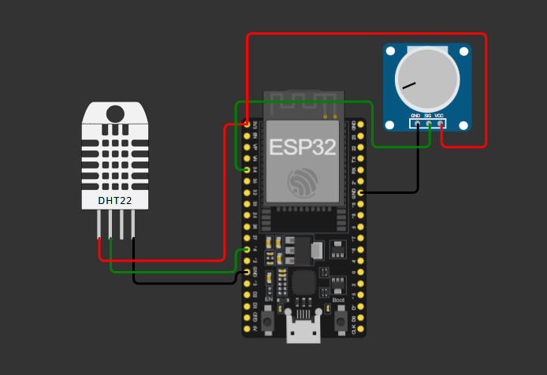

# Smart-Plant-Monitoring

ESP32 project using DHT22, soil moisture sensor, MQTT, HiveMQ Cloud and Adafruit IO.

## Description

This project uses an ESP32 to monitor plant conditions in real time by measuring temperature, humidity and soil moisture.

## Components

- ESP32
- DHT22 temperature and humidity sensor
- Soil moisture sensor

## Technologies

- MicroPython
- MQTT
- HiveMQ Cloud
- Adafruit IO
- Wokwi

## Sensor Connections

- DHT22 data pin: GPIO 14
- Soil moisture analog output: GPIO 34

## Features

- Reads temperature and air humidity.
- Measures soil moisture.
- Sends sensor data to HiveMQ Cloud using MQTT.
- Sends individual sensor values to Adafruit IO.
- Updates readings every 5 seconds.

## Setup

1. Configure the Wi-Fi connection.
2. Add the HiveMQ credentials.
3. Add the Adafruit IO username and AIO key.
4. Upload `main.py` to the ESP32.
5. Run the project and check the Adafruit IO dashboard.

## Circuit Diagram

## Wokwi Simulation

The project can be tested using the following simulation:

https://wokwi.com/projects/476677758774348801

## Security

Do not publish real passwords or API keys in a public repository.

